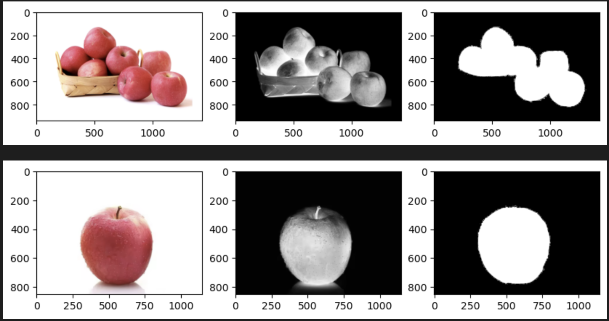

# GMM-Image Segmentation

Didn't use sklearn but write my own GMM code.

Using the color information in image, build Gaussian mixture model of "apple" and "non-apple". Use bayesian posteriori to determine which category each pixel belongs to. 

The result is shown below.

